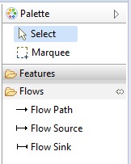
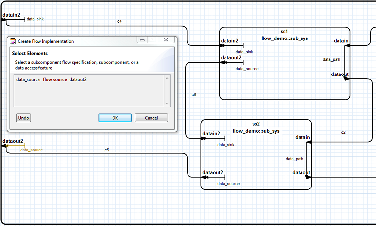
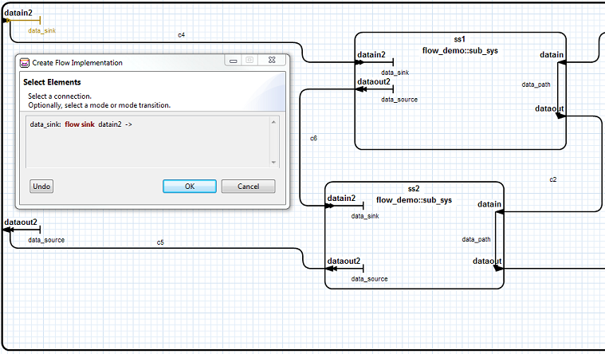
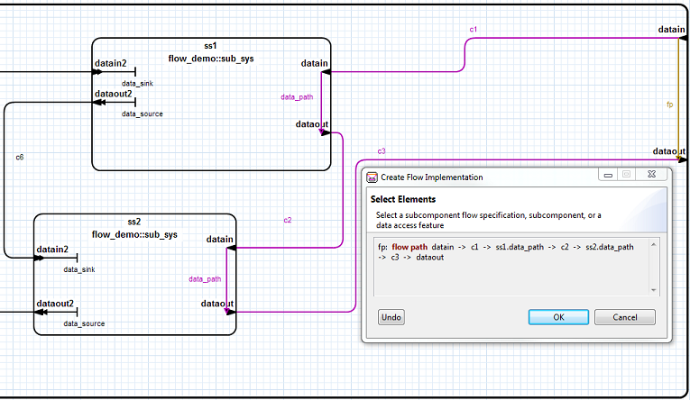
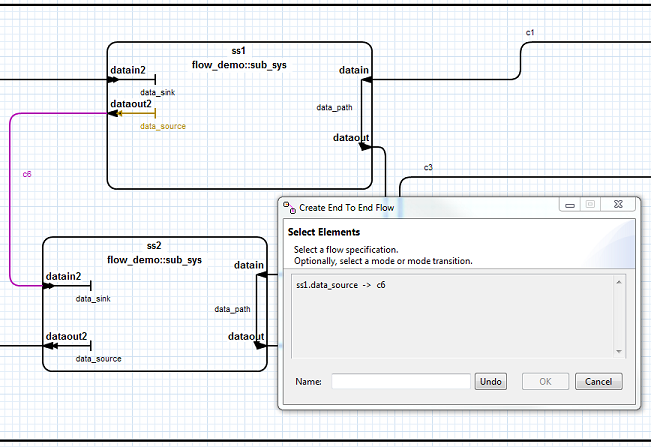

## Flows
The graphical editor supports creating and editing flow specifications, flow implementations, and end-to-end flows.

### Creating Flow Specifications
Flow paths, flow sinks, and flow sources can be created using the palette when editing a component type.

#### Creating Flow Paths
1. Select *Flow Path* from the palette.

2. Select the feature to use as the start of the flow path.

3. Select the feature to use as the end of the path. The new flow path will appear.

#### Creating Flow Sinks
1. Select *Flow Sink* from the palette.

2. Select the feature to use as the sink. The new flow sink will appear.

#### Creating Flow Sources
1. Select *Flow Source* from the palette.

2. Select the feature to use as the source. The new flow source will appear.

### Creating Flow Implementations and End-To-End Flow Specifications
When editing a component implementation, flow implementations and end-to-end flow specifications can be created graphically by selecting the *Create Flow Implementation* and *Create End-To-End Flow Specification* tools from the toolbar and following the prompts to select a series of elements from the diagram. The dialog and colors of elements in the diagram will update as valid selections are made. The starting flow specification will be highlighted dark orange and flow elements will be highlighted purple. The *Undo* button will remove the elements in the order they were selected.

#### Creating Flow Implementations
Select *Create Flow Implementation* from the toolbar, the dialog will appear. 

#### Creating Source Flow Implementations
1. Select a valid source flow specification in the top-level component implementation.

2. Select a valid subcomponent flow specification, subcomponent, or data access.

3. Select valid flow segments leading to the source flow specification. Optionally, select modes or mode transitions.

4. Select *OK* when done.

#### Creating Sink Flow Implementations
1. Select a valid sink flow specification in the top-level component implementation.

2. Select a valid connection.

3. Select valid flow segments leading to the end subcomponent flow. Optionally, select modes or mode transitions.

4. Select *OK* when done.

#### Creating Path Flow Implementations
1. Select a valid path flow specification in the top-level component implementation.

2. Select a valid connection.

3. Select valid flow segments leading to the path flow specification's out flow end. Optionally, select modes or mode transitions.

4. Select *OK* when done.

#### Creating End-To-End Flow Specifications
Select *Create End-To-End Flow Specification* from the toolbar, the dialog will appear. 

1. Select a valid subcomponent source flow specification.

2. Select a valid connection.

3. Select valid flow segments. Optionally, select modes or mode transitions.

4. Specify a name for the End-To-End Flow Specification and select *OK* when done.

### Editing Flow Implementations and End-to-End Flows
When editing a component implementation, flow implementations and end-to-end flow can be edited using the flow editor. It can be accessed by right-clicking in the diagram and selecting *Edit Flows...* from the context menu.

### Highlighting Flow Implementations and End-to-End Flow Specifications
Selecting a flow implementation or end-to-end flow specification from the flow drop-down in the toolbar will highlight the flow.